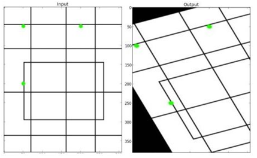
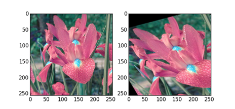

# 2D姿态估计之前对图像的一般处理

**1. 仿射变换**

用途：解决对图像直接不同比例的resize后失真，丢失部分信息，同时实现图像的旋转和变形

原理：放射矩阵一种二维坐标到二维坐标之间的线性变换，保持二维图形的“平直性”（译注：straightness，即变换后直线还是直线不会打弯，圆弧还是圆弧）和“平行性”（译注：parallelness，其实是指保二维图形间的相对位置关系不变，平行线还是平行线，相交直线的交角不变。）。仿射变换可以通过一系列的原子变换的复合来实现，包括：平移（Translation）、缩放（Scale）、翻转（Flip）、旋转（Rotation）和剪切（Shear）。
[1](http://blog.sciencenet.cn/blog-605185-672291.html)

方法：仿射变化需要一个仿射矩阵M，但是由于仿射变换比较复杂，一般直接找很难找到这个矩阵，opencv提供了根据变换前后三个点的对应关系来自动求解M。这个函数是 
M=cv2.getAffineTransform(pos1,pos2),其中两个位置就是变换前后的对应位置关系。输出的就是仿射矩阵M。然后在使用函数cv2.warpAffine()。形象化的图如下（引用参考的）

 

```python
import cv2
import numpy as np
import matplotlib.pyplot as plt
img = cv2.imread('flower.jpg')
rows,cols = img.shape[:2]
pts1 = np.float32([[50,50],[200,50],[50,200]])
pts2 = np.float32([[10,100],[200,50],[100,250]])
M = cv2.getAffineTransform(pts1,pts2)
#第三个参数：变换后的图像大小
res = cv2.warpAffine(img,M,(rows,cols))
plt.subplot(121)
plt.imshow(img)
plt.subplot(122)
plt.imshow(res)
```


**2. 骨骼点居中对齐**

一般来讲，2D人体姿态估计数据集为16个点（MPII，Human3.6）或17个点（COCO），在训练时需要注意这些点的顺序和索引值。

以16个关键点为例，默认顺序为：
["rightAnkle","rightKnee","rightHip",
 "leftHip","leftKnee","leftAnkle",
 "pelvis", "throax","upper_neck", "head_top",
 "rightWrist","rightElbow","rightShoulder",
 "leftShoulder","leftElbow","leftWrist"]
 
关节点的连接为：[[0, 1], [1, 2], [2, 6], [6, 3], [3, 4], [4, 5], [6, 7], [7, 8], [8, 9], [7, 12], [12, 11], [11, 10], [7, 13], [13, 14], [14, 15]]
 
在进行数据预处理时，如果使用自顶向下方法一般要先检测出人体，在传入网络中的图片中人体居中。
骨骼点一般以第7个点（骨盆）为中心进行中心化。
 
**3. Python OpenCV的问题**
 
如果某个函数传入参数是Image，然后使用cv2在上面绘图（画线、框），直接画完返回可能会无效
 
解决方法是先对Image进行copy()。
 
**4. 16、17个关节点的转换**
 
网上没有搜到相关函数或者接口。由于关节点的数量直接决定了网络的输出，所以需要针对不同的数据集训练不同的模型。
如果有现成的17个点预测模型，需要将结果传到16个点的后续任务中怎么办？

我手写了一个[小接口](coco2mpii.py)，用COCO数据集中头部的几个关键点位置来计算出16个点中对应的坐标。
 
**注意**这仅仅是一个图省事自己写的代码，最好方法还是调整网路输出进行fine-tune，不能保证计算的准确性和鲁棒性。
 
    如果检测出了鼻子，那么鼻子作为脑袋的中心点 尺度距离=鼻子到眼睛中心点
        # 头顶是鼻子+尺度距离*3
        # 脖子是鼻子-尺度距离*3
        # 胸口是鼻子-尺度距离*6
    没有鼻子就是耳朵中心作为中心点
    没有耳朵就是眼睛 双眼中心 再不行就是单眼
    
    鼻子/耳朵为中心点 但 眼睛不存在
        # 眼睛作为中心点
        # 中心点 尺度距离=两个肩膀中心到眼睛中心点
        # 头顶是眼睛+尺度距离
        # 脖子是鼻子-尺度距离*0.5
        # 胸口是眼睛-尺度距离*1.5

**5. 图像归一化**
```python
import numpy as np
def img_norm(image):
    mean = np.array([123.675, 116.280, 103.530])
    std = np.array([58.395, 57.120, 57.375])
    image = np.transpose(image, (0, 3, 1, 2)) #batch chanel width height
    image = image.astype(np.float32) #关键
    for n_c in range(3):
        if mean is not None and std is not None:
            image[:, n_c, :, :] = (image[:, n_c, :, :] - mean[n_c]) / std[n_c]
    return image
```

 


