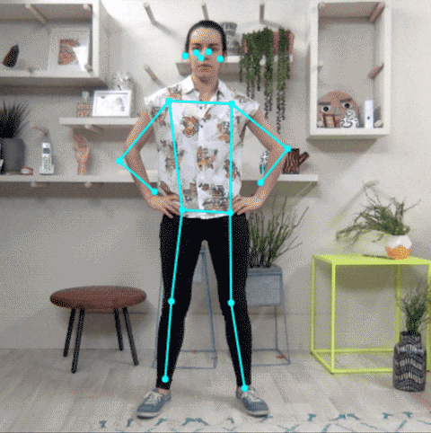

# PoseNet 实时2D姿态估计

[官方Github](https://github.com/tensorflow/tfjs-models/tree/master/posenet)

**该方法是Tensorflow.js轻量级应用，能在i5CPU上达到100fps。已经出了v2版本**

**精度。。MobileNet的基础网络还能要求太高，但是简单场景还可以。**

 
 

原方法是Tensorflow开发的前端2D人体姿态识别接口，能在浏览器中对摄像头采集图片进行实时分析，不需要将数据传到后台，因此非常安全，模型小。

[第三方Github](https://github.com/rwightman/posenet-python)

有人把模型和代码整理到了本地，做了一个使用cv2开启本地摄像头运行的Demo（仅限于v1）。

网络的结构也非常简单：一个基础的BackBone网络，v1里是MobileNet，网络的输出是：

 

1. 经过sigmoid归一化的2D坐标Heatmap nx22x22x17
2. 坐标偏移量offsets nx22x22x34 （17个节点*2）
3. 正向关节点连接分数displacementFwd nx22x22x32 （16个连接*2）
4. 反向关节点连接分数displacementBwd nx22x22x32 （16个连接*2）

 
 

(上图为单人姿态预测的情况)

得到输出后，通过正反向关节点连接分数计算关节点是不是属于同一个人，然后通过非极大值抑制（NMS）算法合并重复检测的人，根据每个人的坐标和heatmap计算如下值：

1. 关节点坐标 17个(x,y)坐标 未检测的点为(0,0)
2. 关节点坐标置信度 17个0-1之间的分数 未检测的点为0
3. 个人姿态置信度 1个0-1之间的分数，用于形容该人整体姿态的完整性，完整性弱的姿态直接删除，可以用所有关节点的置信度平均分计算

之后将0分的坐标过滤，就可以实现实时2D姿态绘制，速度特别快

