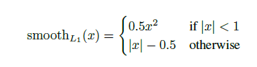
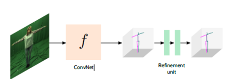

# 3D人体姿态估计

论文：[Self-Supervised Learning of 3D Human Pose using Multi-view Geometry](https://arxiv.org/abs/1903.02330)

[Github](https://github.com/mkocabas/EpipolarPose/)

**该方法局限于训练时的数据集，无法在训练集以外的业务场景中泛化，已由作者本人在Github上确认。**

该方法大致步骤为：

 

•	从2D多目图片中预测3D姿态 
1.	输入不同视角的2D图像产生极线位置 （右侧两条分支）
2.	由极线位置生成3D姿态A
3.	由原始图像直接生成3D姿态B（左侧分支）
4.	A与B进行自监督学习 

 

如上图，2D与3D部分的主要构成都是类似Hourglass的结构，为一个ResNet50+Deconv恢复维度，生成的Heatmap经过Softmax计算，得到各种的关节预测结果。

每一个Hourglass都是在MPII 2D姿态数据集上预训练的，下半部分2D姿态估计在训练过程中是冻结（Frozen）的，也就是说只使用这个预训练好的网络得到结果，不更新参数。
作者说使用它原因是避免直接生成3D坐标会使得所有坐标值坍塌到一个点。

在训练时，算法步骤2由已知的相机内参数（焦距、主点）、外参数（旋转角和平移位置），建立一个针孔图像投影模型（pinhole image projection model）计算3D坐标。

 

针对相机旋转角未知的情况，作者也提出使用RANSAC算法在多目图片中求解相机的旋转角（以第一个相机为中心），然后使用三角多项式计算3D坐标。

求解R的过程其实很有意思：两个相机分别拍摄的图片中，相同的关节点Ui和Ui+1满足：
对任意节点j，有Ui,jFUi+1,j=0，然后计算本质矩阵E=KTFK，将E奇异值分解，就可以得到R的4个解，带入3D投影能得到正的Z轴值的就是求得的R。

实际上在训练和测试过程中，需要计算和更新参数的就是红色底的3D姿态生成部分，在测试时也只需要加载这部分的网络。

2D姿态转换计算的结果A和3D直接生成的结果求差为x，然后计算loss：

 

优化单元：接受3D结果/噪声输入 

•	2个计算单元 

•	BN，LReLU，DropOut 

•	有监督地计算残差损失 

 

目前有一些问题：（应用场景：人在圆形遮挡物后旋转）

•	从头训练需要多角度摄像头构建极线位置 

•	论文并没有讨论该方法的实时性 – 测试大约0.6s 

•	在图像尺寸不匹配、场景复杂时效果差 

解决方案：

•	输入图片使用仿射变换 旋转缩放 

•	数据增强，增加使用场景下的遮挡，准备增加霍夫变换识别圆形

实验验证：

1. 增加固定遮挡（80%圆形+30%随机） 人在遮挡后旋转 
2. 原始模型下原始采集图片输入 结果很差
3. 原始模型下经过人工裁剪之后作为输入 效果可以 
4. 小batch进行fine-tune之后 经过人工裁剪之后作为输入 效果不错

输出维度细节：

	深度网络的输出Preds：
    Preds (1,1024,64,64): batch, depth* joints, height, width
    Reshape(1,16,-1): batch, joints ,3D 每个关节64*64*64
    Softmax(1,16,-1): dim2 归一化: sum(preds,2) = 1
    heatmaps.reshape(1,16,64,64,64): batch, joints, depth , height, width
    accu_x = sum(dim=2 depth)→sum(dim=2 height): batch, joints, width 1,16,64
    accu_y = sum(dim=2 depth)→sum(dim=3 width): batch, joints, height 1,16,64
    accu_z = sum(dim=3 height)→sum(dim=3 width): batch, joints, depth 1,16,64
    accu_x |accu_y |accu_z 分别 sum(dim=2 xyz) 求和 1,16 → x, y, z
    (x, y, z)/(64,64,64)-0.5 三维坐标系居中
    Cat, Reshape(1,48): 拼接

	数据集标签输入Labels：
    输入224图像时，首先处理关节点坐标，将xyz缩放到图片尺度，并且中心在112,112
    Joints[:,:]-=Joints[6,:] 居中
    提取匹配图片尺寸的2D姿态标签pts，计算3D姿态标签的缩放尺度
    Scale= (2D骨架长度之和)/(3D骨架长度之和) = 0.127435
    joints[:, :2] *= scale+112 缩放 居中
    Joints[:,0]=width- Joints[:,0]-1: 左右互换
    Joints[:,0:2] 根据图像仿射变换进行旋转
    Joints[:,2] = joints[:2]/(2000*scale)*256 深度归一化，根据仿射变换缩放系数恢复到256
    (Joints[:,0:2])/(256,256)-0.5三维坐标系居中
    (Joints[:,2])/(256) 深度已经是居中值

	测试画图：
    输出Preds (1,1024,64,64): batch, depth* joints, height, width
    Reshape(1,16,-1): batch, joints ,3D 每个关节64*64*64
    Softmax(1,16,-1): dim2 归一化: sum(preds,2) = 1
    heatmaps.reshape(1,16,64,64,64): batch, joints, depth , height, width
    accu_x = sum(dim=2 depth)→sum(dim=2 height): batch, joints, width 1,16,64
    accu_y = sum(dim=2 depth)→sum(dim=3 width): batch, joints, height 1,16,64
    accu_z = sum(dim=3 height)→sum(dim=3 width): batch, joints, depth 1,16,64
    accu_x |accu_y |accu_z 分别 sum(dim=2 xyz) 求和 1,16 → x, y, z
    (x, y, z)/( 64,64,64)-0.5 三维坐标系居中
    Cat, Reshape(1,48): 拼接
    Reshape(1,16,3)
    ((x,y)+0.5)*256 缩放并挪到正坐标
    z*256 缩放
    拼接 传送给画图函数 按照关节顺序连接3D坐标点

**无法解决的问题:**

模型的性能比较和实验测试都是在Human3.6数据集上进行的，在使用该模型对其他数据进行测试时效果很差。

也就是说应用于具体场景前，使用公共数据集进行训练是不够的，需要采集场景下的多目图片重新训练或者fine-tune。

 

