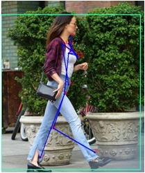
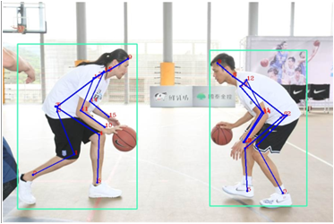

# 图像-2D-3D实验结果和分析比较

设备：1080Ti，将多个模型部署在服务器后端后测试计算时间

**2D：**

| 方法  | 结果1  | 时间  | 结果2  | 时间  | 备注  |
|  ----  | ----  | ----  | ----  | ----  | ----  |
| Stacked Hourglass  |  |0.032s| | 0.029s|四阶 YOLOv1 0.021s
| OpenPose |  |0.142s| |0.2365s|直接2D
| Simple Baseline |  |0.0175s | |0.0205s|YOLOv3 0.1164s 0.0925s
| HRNet |  |0.0733s| |0.0950s|YOLOv3 0.1164s 0.0925s

所有的原始图片，对于自上而下的方法，都先经由目标检测网络检测人体，将所有检测到的人体检测框区域经过仿射变换转换为特定尺寸，归一化后作为一个Batch输入网络。

对于OpenPose，直接给出所有的2D人体姿态预测结果

从速度上来说，Simple Baseline + YOLOv3和OpenPose在同一个水平

精度上，HRNet在CVPR2019中刷新了最佳结果，但是网络较为复杂，模型也大

目前给出的速度由time.time()计算，还没有对模型进行优化加速

**3D：**

| 方法  | 结果1  | 时间  | 结果2  | 时间  | 备注  |
|  ----  | ----  | ----  | ----  | ----  | ----  |
| OpenPose|  |0.82s | | 0.2696s|全过程 0.9177s 0.4673s
| SematicGCN |  |0.002s| |0.002s|全过程 0.2319s 0.1965s
| RepNet |  |0.0022s | |0.0011s|全过程 0.1992s 0.1704s

对于自上而下的方法，都先经由Yolo3检测人体，再采用HRNet给出的2D姿态坐标作为输入

对于OpenPose，直接将所有检测的人体坐标乘相同的矩阵以及一连串运算

SGCN在构建模型前传入图的邻接表和Non Local计算规则，语义卷积的实现使用稀疏矩阵相乘，影响速度；输入网络的二维关节调整到以第7个中心

RepNet输入和输出都是一维矩阵，输入进行归一化，输出为16个x坐标+16个y坐标+16个z坐标。由于相机网络特性，会自动纠正角度

